# Technical Specifications

## 1. INTRODUCTION

### EXECUTIVE SUMMARY

| Aspect | Description |
|--------|-------------|
| Project Overview | A simple Node.js HTTP server application that exposes a single REST endpoint `/hello` which returns "Hello world" to clients |
| Business Problem | Provides a minimal, functional example of a Node.js web service that can serve as a learning tool or starter template |
| Key Stakeholders | Developers learning Node.js, technical trainers, software engineers requiring a baseline implementation |
| Value Proposition | Demonstrates fundamental Node.js web service concepts with minimal complexity, enabling rapid learning and implementation |

### SYSTEM OVERVIEW

#### Project Context

The Node.js Hello World service operates as a standalone web application that demonstrates core Node.js HTTP server capabilities. This implementation serves as:

- A learning resource for developers new to Node.js
- A reference implementation for basic HTTP service patterns
- A starting point for more complex Node.js applications
- A testing tool for HTTP client implementations

#### High-Level Description

| Component | Description |
|-----------|-------------|
| Primary Capabilities | HTTP request handling, response generation, and server lifecycle management |
| Major Components | Node.js runtime, HTTP server module, route handler for `/hello` endpoint |
| Technical Approach | Lightweight, dependency-minimal implementation using Node.js core modules |

#### Success Criteria

| Criteria Type | Description |
|---------------|-------------|
| Measurable Objectives | - Server successfully starts and listens on configured port<br>- `/hello` endpoint returns "Hello world" with 200 status code<br>- Documentation enables new users to run the application |
| Critical Success Factors | - Minimal complexity while maintaining best practices<br>- Clear separation of server setup and route handling<br>- Proper error handling for robustness |
| Key Performance Indicators | - Server startup time under 1 second<br>- Response time under 50ms for the `/hello` endpoint<br>- Resource utilization below 50MB memory |

### SCOPE

#### In-Scope

**Core Features and Functionalities**

- HTTP server implementation using Node.js
- Single REST endpoint (`/hello`) returning text response
- Server configuration (port, host)
- Basic error handling
- Documentation for setup and usage

**Implementation Boundaries**

| Boundary Type | Coverage |
|---------------|----------|
| System Boundaries | Self-contained Node.js application with no external service dependencies |
| User Groups | Developers and technical learners |
| Geographic Coverage | Not applicable - runs locally or can be deployed anywhere |
| Data Domains | HTTP request/response handling only |

#### Out-of-Scope

- Authentication and authorization mechanisms
- Multiple endpoints beyond `/hello`
- Database integration
- Logging infrastructure
- Containerization or deployment configurations
- Performance optimization
- Frontend client implementation
- Testing frameworks and test suites
- CI/CD pipeline integration
- Production hardening (security, scaling)

## 2. PRODUCT REQUIREMENTS

### FEATURE CATALOG

#### Feature Metadata

| ID | Feature Name | Feature Category | Priority Level | Status |
|----|--------------|------------------|----------------|--------|
| F-001 | HTTP Server | Core Infrastructure | Critical | Proposed |
| F-002 | Hello Endpoint | API | Critical | Proposed |
| F-003 | Server Configuration | Configuration | High | Proposed |
| F-004 | Error Handling | Reliability | Medium | Proposed |

#### Feature Descriptions

**F-001: HTTP Server**

| Aspect | Description |
|--------|-------------|
| Overview | Core Node.js HTTP server implementation that listens for incoming requests |
| Business Value | Provides the fundamental infrastructure for serving HTTP requests |
| User Benefits | Enables developers to understand basic Node.js server implementation patterns |
| Technical Context | Uses Node.js built-in HTTP module to create and manage server lifecycle |

**F-002: Hello Endpoint**

| Aspect | Description |
|--------|-------------|
| Overview | REST endpoint at path `/hello` that returns "Hello world" text response |
| Business Value | Demonstrates basic HTTP request/response handling in Node.js |
| User Benefits | Provides a working example of route handling and response generation |
| Technical Context | Implements request routing and text response formatting |

**F-003: Server Configuration**

| Aspect | Description |
|--------|-------------|
| Overview | Configuration mechanism for server port and host settings |
| Business Value | Enables flexibility in deployment environments |
| User Benefits | Allows developers to customize server network settings |
| Technical Context | Implements environment variable support or configuration defaults |

**F-004: Error Handling**

| Aspect | Description |
|--------|-------------|
| Overview | Basic error handling for server startup and request processing |
| Business Value | Improves reliability and debuggability |
| User Benefits | Provides clear feedback when errors occur |
| Technical Context | Implements try/catch patterns and appropriate error responses |

#### Dependencies

**F-001: HTTP Server**

| Dependency Type | Dependencies |
|-----------------|-------------|
| Prerequisite Features | None |
| System Dependencies | Node.js runtime |
| External Dependencies | None |
| Integration Requirements | None |

**F-002: Hello Endpoint**

| Dependency Type | Dependencies |
|-----------------|-------------|
| Prerequisite Features | F-001 HTTP Server |
| System Dependencies | None |
| External Dependencies | None |
| Integration Requirements | None |

**F-003: Server Configuration**

| Dependency Type | Dependencies |
|-----------------|-------------|
| Prerequisite Features | F-001 HTTP Server |
| System Dependencies | None |
| External Dependencies | None |
| Integration Requirements | None |

**F-004: Error Handling**

| Dependency Type | Dependencies |
|-----------------|-------------|
| Prerequisite Features | F-001 HTTP Server, F-002 Hello Endpoint |
| System Dependencies | None |
| External Dependencies | None |
| Integration Requirements | None |

### FUNCTIONAL REQUIREMENTS TABLE

**F-001: HTTP Server**

| Requirement ID | Description | Acceptance Criteria | Priority | Complexity |
|----------------|-------------|---------------------|----------|------------|
| F-001-RQ-001 | The system shall create an HTTP server using Node.js | Server initializes without errors | Must-Have | Low |
| F-001-RQ-002 | The server shall listen on a configurable TCP port | Server binds to specified port | Must-Have | Low |
| F-001-RQ-003 | The server shall handle incoming HTTP requests | Server receives and processes HTTP requests | Must-Have | Low |

**F-002: Hello Endpoint**

| Requirement ID | Description | Acceptance Criteria | Priority | Complexity |
|----------------|-------------|---------------------|----------|------------|
| F-002-RQ-001 | The system shall implement a GET endpoint at path `/hello` | Endpoint responds to GET requests at `/hello` | Must-Have | Low |
| F-002-RQ-002 | The `/hello` endpoint shall return "Hello world" as plain text | Response body contains exactly "Hello world" | Must-Have | Low |
| F-002-RQ-003 | The `/hello` endpoint shall return HTTP status code 200 | Response status code is 200 | Must-Have | Low |
| F-002-RQ-004 | The `/hello` endpoint shall set Content-Type header to "text/plain" | Response includes correct Content-Type header | Should-Have | Low |

**F-003: Server Configuration**

| Requirement ID | Description | Acceptance Criteria | Priority | Complexity |
|----------------|-------------|---------------------|----------|------------|
| F-003-RQ-001 | The system shall use a default port of 3000 if not configured | Server starts on port 3000 when no port is specified | Should-Have | Low |
| F-003-RQ-002 | The system shall allow port configuration via environment variable | Server uses port specified in environment variable | Should-Have | Low |

**F-004: Error Handling**

| Requirement ID | Description | Acceptance Criteria | Priority | Complexity |
|----------------|-------------|---------------------|----------|------------|
| F-004-RQ-001 | The system shall log server startup errors | Error messages appear in console for startup failures | Should-Have | Low |
| F-004-RQ-002 | The system shall return 404 status for undefined routes | Requests to paths other than `/hello` receive 404 status | Should-Have | Low |

### Technical Specifications

**F-001: HTTP Server**

| Aspect | Specification |
|--------|---------------|
| Input Parameters | None |
| Output/Response | HTTP server instance |
| Performance Criteria | Server startup time < 1 second |
| Data Requirements | None |

**F-002: Hello Endpoint**

| Aspect | Specification |
|--------|---------------|
| Input Parameters | HTTP GET request to `/hello` path |
| Output/Response | HTTP 200 response with "Hello world" text |
| Performance Criteria | Response time < 50ms |
| Data Requirements | None |

**F-003: Server Configuration**

| Aspect | Specification |
|--------|---------------|
| Input Parameters | PORT environment variable (optional) |
| Output/Response | None |
| Performance Criteria | None |
| Data Requirements | None |

**F-004: Error Handling**

| Aspect | Specification |
|--------|---------------|
| Input Parameters | HTTP request to undefined route |
| Output/Response | HTTP 404 response |
| Performance Criteria | Error response time < 50ms |
| Data Requirements | None |

### FEATURE RELATIONSHIPS

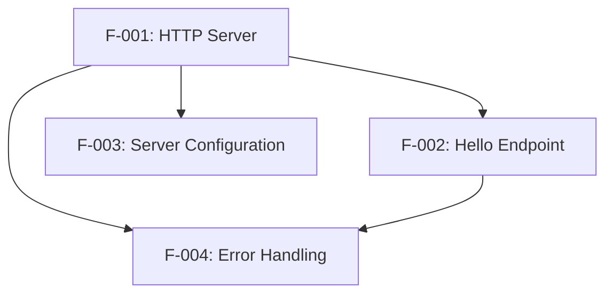
```mermaid
graph TD
    F001[F-001: HTTP Server]
    F002[F-002: Hello Endpoint]
    F003[F-003: Server Configuration]
    F004[F-004: Error Handling]
    
    F001 --> F002
    F001 --> F003
    F001 --> F004
    F002 --> F004
```

### IMPLEMENTATION CONSIDERATIONS

**F-001: HTTP Server**

| Consideration | Description |
|---------------|-------------|
| Technical Constraints | Use Node.js built-in HTTP module only |
| Performance Requirements | Minimal memory footprint (<50MB) |
| Scalability Considerations | None for this simple implementation |
| Security Implications | None for this basic example |
| Maintenance Requirements | Keep Node.js version compatibility in documentation |

**F-002: Hello Endpoint**

| Consideration | Description |
|---------------|-------------|
| Technical Constraints | Implement with core Node.js functionality only |
| Performance Requirements | Response time < 50ms |
| Scalability Considerations | None for this simple implementation |
| Security Implications | None for this basic endpoint |
| Maintenance Requirements | None |

**F-003: Server Configuration**

| Consideration | Description |
|---------------|-------------|
| Technical Constraints | Use environment variables for configuration |
| Performance Requirements | None |
| Scalability Considerations | None |
| Security Implications | Avoid hardcoding sensitive configuration |
| Maintenance Requirements | Document configuration options |

**F-004: Error Handling**

| Consideration | Description |
|---------------|-------------|
| Technical Constraints | Use standard Node.js error handling patterns |
| Performance Requirements | Error responses < 50ms |
| Scalability Considerations | None |
| Security Implications | Avoid exposing system details in error messages |
| Maintenance Requirements | None |

### TRACEABILITY MATRIX

| Requirement ID | Feature ID | Priority | Status |
|----------------|-----------|----------|--------|
| F-001-RQ-001 | F-001 | Must-Have | Proposed |
| F-001-RQ-002 | F-001 | Must-Have | Proposed |
| F-001-RQ-003 | F-001 | Must-Have | Proposed |
| F-002-RQ-001 | F-002 | Must-Have | Proposed |
| F-002-RQ-002 | F-002 | Must-Have | Proposed |
| F-002-RQ-003 | F-002 | Must-Have | Proposed |
| F-002-RQ-004 | F-002 | Should-Have | Proposed |
| F-003-RQ-001 | F-003 | Should-Have | Proposed |
| F-003-RQ-002 | F-003 | Should-Have | Proposed |
| F-004-RQ-001 | F-004 | Should-Have | Proposed |
| F-004-RQ-002 | F-004 | Should-Have | Proposed |

## 3. TECHNOLOGY STACK

### PROGRAMMING LANGUAGES

| Language | Component | Version | Justification |
|----------|-----------|---------|---------------|
| JavaScript | Server | ES6+ | Native language for Node.js runtime with excellent HTTP server capabilities and asynchronous processing |
| JSON | Configuration | N/A | Industry standard for Node.js project configuration (package.json) |

JavaScript is the optimal choice for this project as it's the native language of the Node.js runtime, providing direct access to the core HTTP module without additional dependencies. ES6+ features enable cleaner code organization through modern syntax while maintaining compatibility with the Node.js ecosystem.

### FRAMEWORKS & LIBRARIES

| Framework/Library | Version | Purpose | Justification |
|-------------------|---------|---------|---------------|
| Node.js | 18.x LTS | Runtime environment | Long-term support version providing stability and security updates while offering modern JavaScript features |
| Node.js HTTP module | Built-in | HTTP server implementation | Core module that provides all necessary HTTP server functionality without external dependencies |

This project intentionally avoids external web frameworks like Express.js to maintain minimal complexity and dependencies, aligning with the project's educational purpose. The built-in HTTP module is sufficient for implementing a single endpoint server, demonstrating core Node.js capabilities without abstraction layers.

### OPEN SOURCE DEPENDENCIES

| Dependency | Version | Purpose | Source |
|------------|---------|---------|--------|
| None | N/A | N/A | N/A |

The project is designed to use only Node.js core modules without external dependencies, maximizing simplicity and minimizing security concerns. This approach demonstrates fundamental Node.js concepts without the complexity of dependency management.

### THIRD-PARTY SERVICES

No third-party services are required for this implementation. The application operates as a standalone HTTP server without external service dependencies.

### DATABASES & STORAGE

No databases or storage solutions are required for this implementation as the application serves static content without data persistence needs.

### DEVELOPMENT & DEPLOYMENT

| Tool | Version | Purpose | Justification |
|------|---------|---------|---------------|
| npm | 9.x+ | Package management | Industry standard for Node.js project initialization and script management |
| Git | 2.x+ | Version control | Industry standard for source code management |
| nodemon | 2.x+ (dev only) | Development server | Optional development dependency for automatic server restarts during development |

#### Development Environment

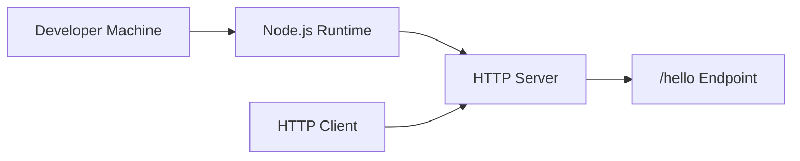
```mermaid
flowchart LR
    A[Developer Machine] --> B[Node.js Runtime]
    B --> C[HTTP Server]
    C --> D["/hello Endpoint"]
    E[HTTP Client] --> C
```

#### Deployment Options

| Deployment Option | Considerations |
|-------------------|----------------|
| Local Environment | Simplest option for educational purposes |
| Cloud Platforms | Can be deployed to any platform supporting Node.js (AWS, Azure, GCP, etc.) |
| Containerization | Optional Docker deployment for consistent environments |

The development and deployment tools are intentionally minimal to focus on the core Node.js implementation. For educational purposes, complex deployment pipelines are unnecessary, though the application can easily be adapted to various deployment strategies as needed.

## 4. PROCESS FLOWCHART

### SYSTEM WORKFLOWS

#### Core Business Processes

##### HTTP Request Processing Workflow

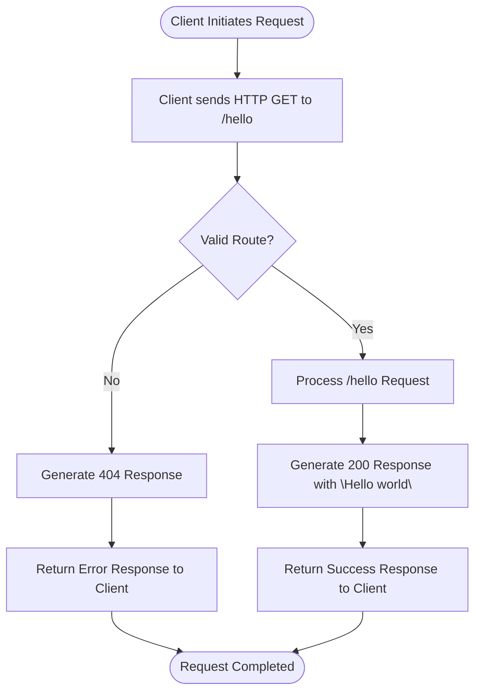
```mermaid
flowchart TD
    Start([Client Initiates Request]) --> A[Client sends HTTP GET to /hello]
    A --> B{Valid Route?}
    B -->|Yes| C[Process /hello Request]
    B -->|No| D[Generate 404 Response]
    C --> E["Generate 200 Response with \"Hello world\""]
    D --> F[Return Error Response to Client]
    E --> G[Return Success Response to Client]
    F --> End([Request Completed])
    G --> End
```

This workflow represents the core request handling process from client initiation to response delivery. The primary decision point occurs at route validation, determining whether to process a valid request or return an error response.

##### Server Lifecycle Workflow

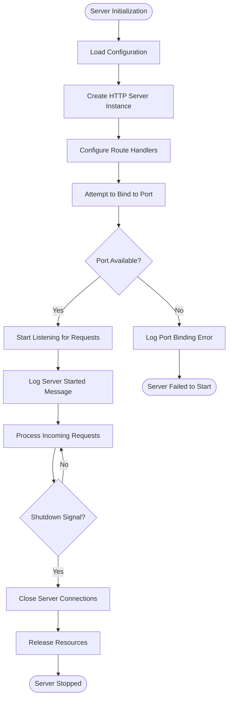
```mermaid
flowchart TD
    Start([Server Initialization]) --> A[Load Configuration]
    A --> B[Create HTTP Server Instance]
    B --> C[Configure Route Handlers]
    C --> D[Attempt to Bind to Port]
    D --> E{Port Available?}
    E -->|Yes| F[Start Listening for Requests]
    E -->|No| G[Log Port Binding Error]
    F --> H[Log Server Started Message]
    G --> End([Server Failed to Start])
    H --> I[Process Incoming Requests]
    I --> J{Shutdown Signal?}
    J -->|No| I
    J -->|Yes| K[Close Server Connections]
    K --> L[Release Resources]
    L --> End2([Server Stopped])
```

This diagram illustrates the complete server lifecycle from initialization through operation to graceful shutdown, highlighting configuration loading, error handling for port binding issues, and proper resource cleanup.

#### Integration Workflows

##### Request-Response Data Flow

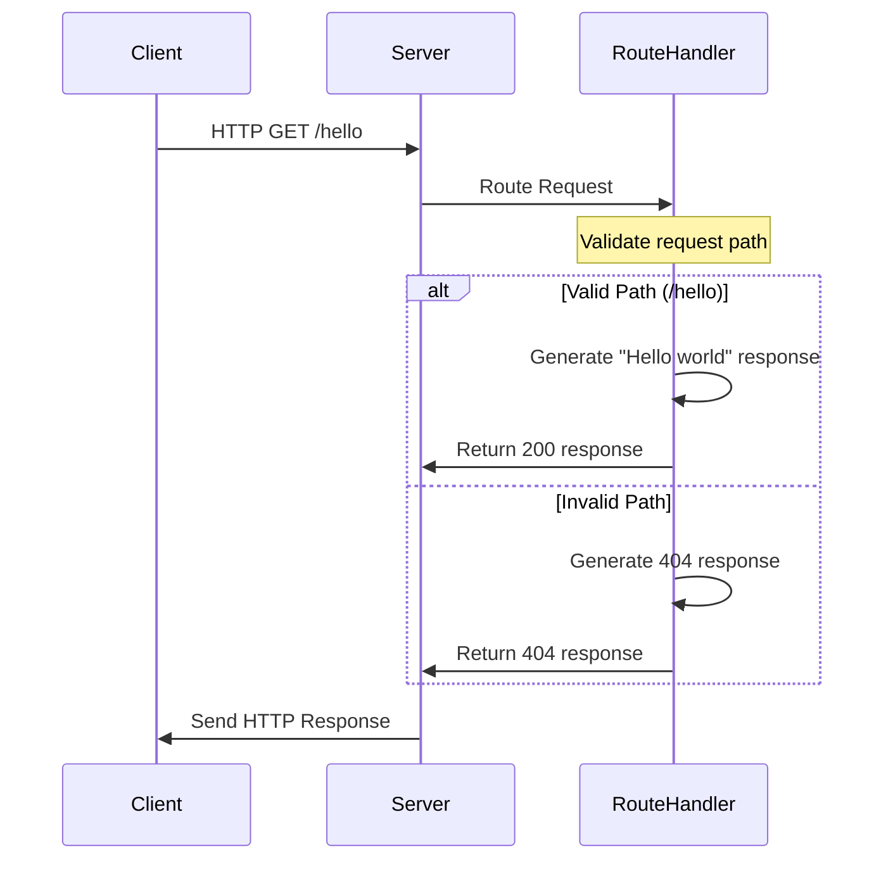
```mermaid
sequenceDiagram
    participant Client
    participant Server
    participant RouteHandler
    
    Client->>Server: HTTP GET /hello
    Server->>RouteHandler: Route Request
    Note over RouteHandler: Validate request path
    
    alt Valid Path (/hello)
        RouteHandler->>RouteHandler: Generate "Hello world" response
        RouteHandler->>Server: Return 200 response
    else Invalid Path
        RouteHandler->>RouteHandler: Generate 404 response
        RouteHandler->>Server: Return 404 response
    end
    
    Server->>Client: Send HTTP Response
```

This sequence diagram shows the interaction between client, server, and route handler components, demonstrating the data flow for both successful and error scenarios.

### FLOWCHART REQUIREMENTS

#### Detailed Request Processing Workflow

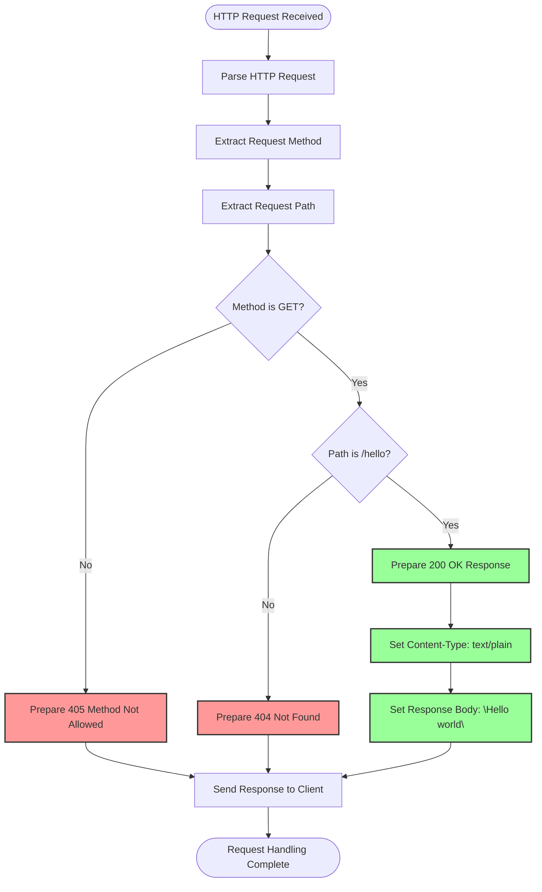
```mermaid
flowchart TD
    Start([HTTP Request Received]) --> A[Parse HTTP Request]
    A --> B[Extract Request Method]
    B --> C[Extract Request Path]
    C --> D{Method is GET?}
    D -->|No| E[Prepare 405 Method Not Allowed]
    D -->|Yes| F{Path is /hello?}
    F -->|No| G[Prepare 404 Not Found]
    F -->|Yes| H[Prepare 200 OK Response]
    H --> I[Set Content-Type: text/plain]
    I --> J["Set Response Body: \"Hello world\""]
    E --> K[Send Response to Client]
    G --> K
    J --> K
    K --> End([Request Handling Complete])
    
    %% Timing constraints
    classDef timing fill:#f9f,stroke:#333,stroke-width:2px
    class J timing
    
    %% Error states
    classDef error fill:#f99,stroke:#333,stroke-width:2px
    class E,G error
    
    %% Success state
    classDef success fill:#9f9,stroke:#333,stroke-width:2px
    class H,I,J success
```

This detailed workflow shows the step-by-step processing of an HTTP request, including method validation, path matching, response preparation, and header setting. The diagram highlights timing constraints for response generation (expected to be under 50ms) and clearly distinguishes between error and success states.

#### Validation Rules Workflow

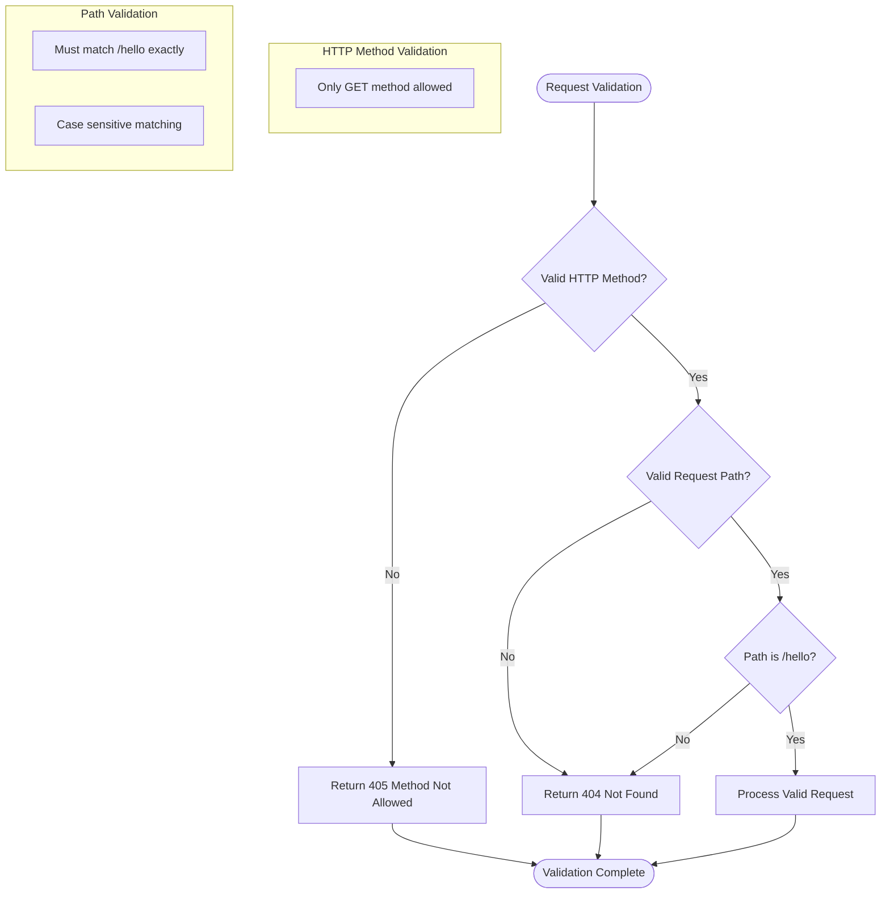
```mermaid
flowchart TD
    Start([Request Validation]) --> A{Valid HTTP Method?}
    A -->|No| B[Return 405 Method Not Allowed]
    A -->|Yes| C{Valid Request Path?}
    C -->|No| D[Return 404 Not Found]
    C -->|Yes| E{Path is /hello?}
    E -->|No| D
    E -->|Yes| F[Process Valid Request]
    F --> End([Validation Complete])
    B --> End
    D --> End
    
    %% Validation rules
    subgraph "HTTP Method Validation"
    VR1[Only GET method allowed]
    end
    
    subgraph "Path Validation"
    VR2[Must match /hello exactly]
    VR3[Case sensitive matching]
    end
```

This workflow illustrates the validation rules applied to incoming requests, showing decision points for HTTP method validation and path validation with specific business rules.

### TECHNICAL IMPLEMENTATION

#### State Management Workflow

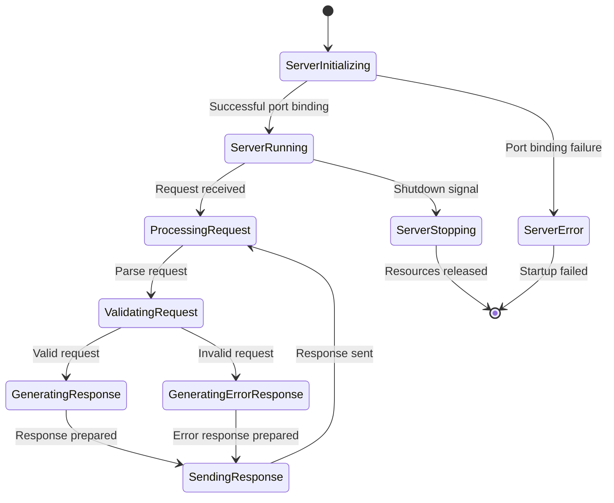
```mermaid
stateDiagram-v2
    [*] --> ServerInitializing
    ServerInitializing --> ServerRunning: Successful port binding
    ServerInitializing --> ServerError: Port binding failure
    
    ServerRunning --> ProcessingRequest: Request received
    ProcessingRequest --> ValidatingRequest: Parse request
    ValidatingRequest --> GeneratingResponse: Valid request
    ValidatingRequest --> GeneratingErrorResponse: Invalid request
    
    GeneratingResponse --> SendingResponse: Response prepared
    GeneratingErrorResponse --> SendingResponse: Error response prepared
    
    SendingResponse --> ProcessingRequest: Response sent
    
    ServerRunning --> ServerStopping: Shutdown signal
    ServerStopping --> [*]: Resources released
    ServerError --> [*]: Startup failed
```

This state diagram shows the server's state transitions from initialization through request processing to shutdown, highlighting the different states during request handling and response generation.

#### Error Handling Workflow

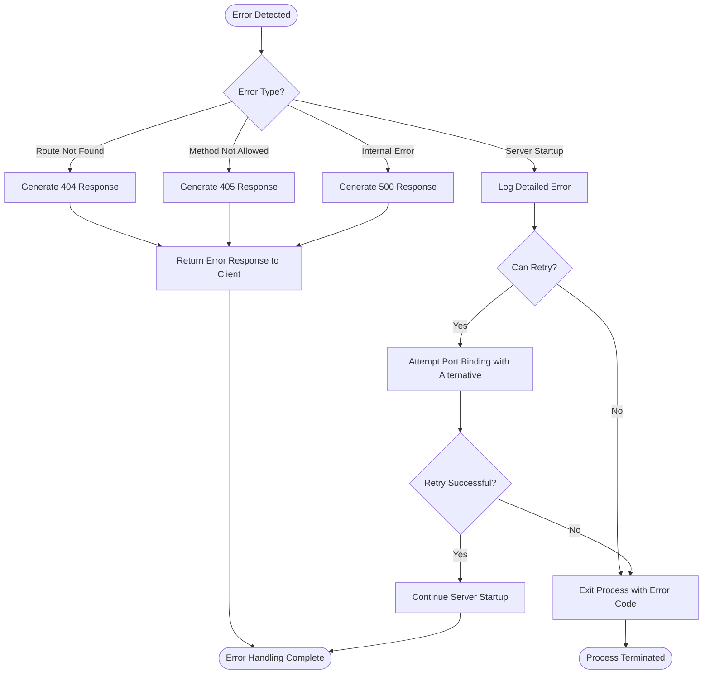
```mermaid
flowchart TD
    Start([Error Detected]) --> A{Error Type?}
    A -->|Server Startup| B[Log Detailed Error]
    A -->|Route Not Found| C[Generate 404 Response]
    A -->|Method Not Allowed| D[Generate 405 Response]
    A -->|Internal Error| E[Generate 500 Response]
    
    B --> F{Can Retry?}
    F -->|Yes| G[Attempt Port Binding with Alternative]
    F -->|No| H[Exit Process with Error Code]
    
    C --> I[Return Error Response to Client]
    D --> I
    E --> I
    
    G --> J{Retry Successful?}
    J -->|Yes| K[Continue Server Startup]
    J -->|No| H
    
    I --> End([Error Handling Complete])
    K --> End
    H --> End2([Process Terminated])
```

This diagram illustrates the error handling strategies for different error types, including server startup errors, routing errors, and internal processing errors, with appropriate recovery paths and client notifications.

### REQUIRED DIAGRAMS

#### High-Level System Workflow

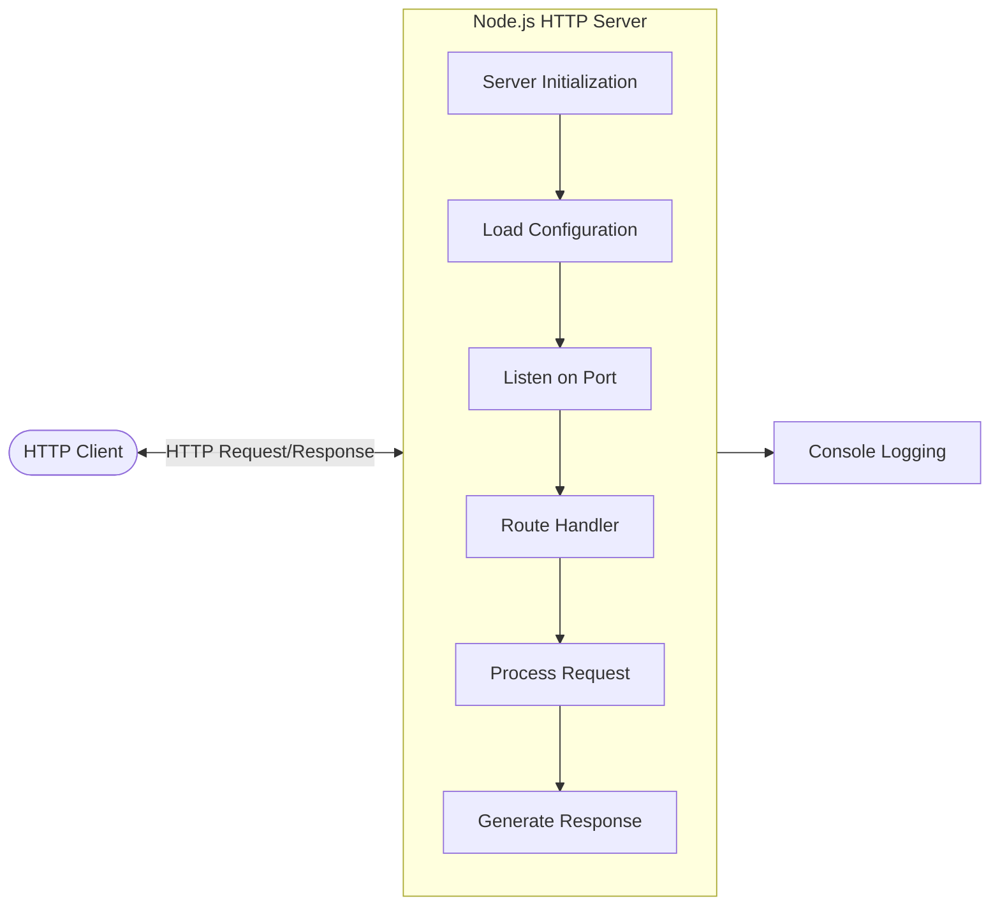
```mermaid
flowchart LR
    Client([HTTP Client]) <-->|HTTP Request/Response| Server
    
    subgraph Server [Node.js HTTP Server]
        direction TB
        Init[Server Initialization] --> Config[Load Configuration]
        Config --> Listen[Listen on Port]
        Listen --> Route[Route Handler]
        Route --> Process[Process Request]
        Process --> Response[Generate Response]
    end
    
    Server --> Log[Console Logging]
```

This high-level diagram provides an overview of the system components and their interactions, showing the flow from client request through server processing to response generation.

#### Detailed Process Flow for Hello Endpoint

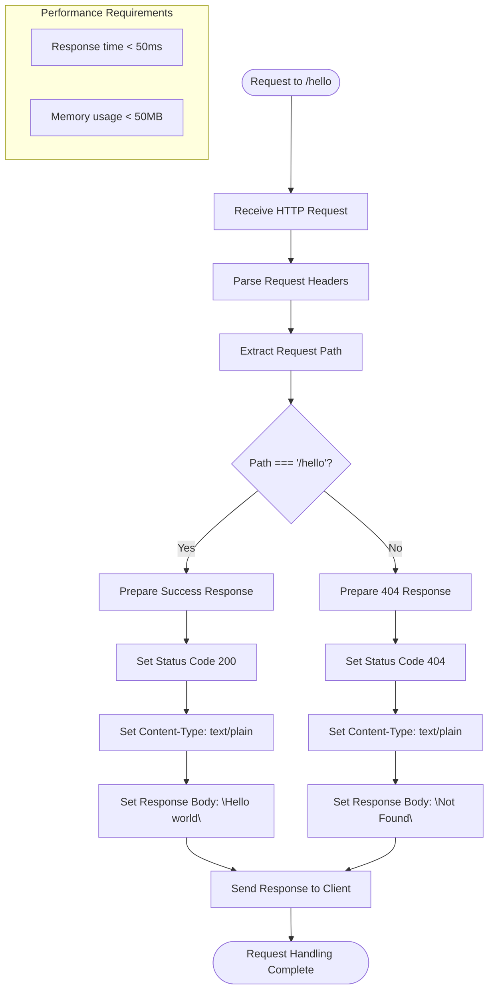
```mermaid
flowchart TD
    Start([Request to /hello]) --> A[Receive HTTP Request]
    A --> B[Parse Request Headers]
    B --> C[Extract Request Path]
    C --> D{Path === '/hello'?}
    D -->|Yes| E[Prepare Success Response]
    D -->|No| F[Prepare 404 Response]
    
    E --> G[Set Status Code 200]
    G --> H["Set Content-Type: text/plain"]
    H --> I["Set Response Body: \"Hello world\""]
    
    F --> J[Set Status Code 404]
    J --> K["Set Content-Type: text/plain"]
    K --> L["Set Response Body: \"Not Found\""]
    
    I --> M[Send Response to Client]
    L --> M
    
    M --> End([Request Handling Complete])
    
    %% SLA indicators
    subgraph "Performance Requirements"
    SLA1[Response time < 50ms]
    SLA2[Memory usage < 50MB]
    end
```

This detailed process flow focuses specifically on the `/hello` endpoint implementation, showing the exact steps from request receipt to response delivery with performance requirements.

#### Integration Sequence Diagram

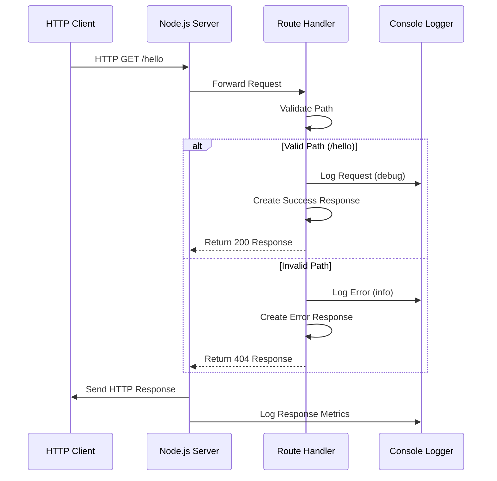
```mermaid
sequenceDiagram
    participant Client as HTTP Client
    participant Server as Node.js Server
    participant Router as Route Handler
    participant Logger as Console Logger
    
    Client->>Server: HTTP GET /hello
    Server->>Router: Forward Request
    Router->>Router: Validate Path
    
    alt Valid Path (/hello)
        Router->>Logger: Log Request (debug)
        Router->>Router: Create Success Response
        Router-->>Server: Return 200 Response
    else Invalid Path
        Router->>Logger: Log Error (info)
        Router->>Router: Create Error Response
        Router-->>Server: Return 404 Response
    end
    
    Server->>Client: Send HTTP Response
    Server->>Logger: Log Response Metrics
```

This sequence diagram illustrates the interactions between different system components during request processing, showing the communication flow and logging points.

#### Error Handling Flowchart

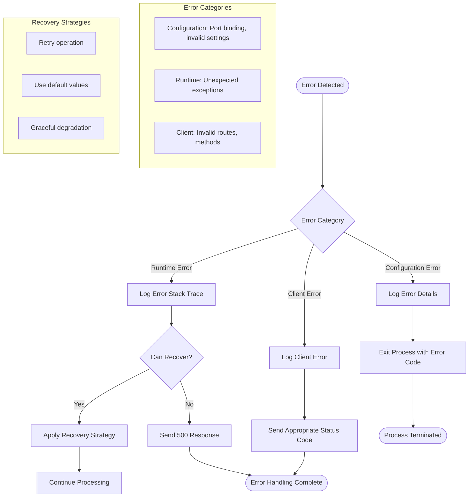
```mermaid
flowchart TD
    Start([Error Detected]) --> A{Error Category}
    
    A -->|Configuration Error| B[Log Error Details]
    B --> C[Exit Process with Error Code]
    
    A -->|Runtime Error| D[Log Error Stack Trace]
    D --> E{Can Recover?}
    E -->|Yes| F[Apply Recovery Strategy]
    E -->|No| G[Send 500 Response]
    
    A -->|Client Error| H[Log Client Error]
    H --> I[Send Appropriate Status Code]
    
    F --> J[Continue Processing]
    G --> End([Error Handling Complete])
    I --> End
    C --> End2([Process Terminated])
    
    subgraph "Error Categories"
    EC1[Configuration: Port binding, invalid settings]
    EC2[Runtime: Unexpected exceptions]
    EC3[Client: Invalid routes, methods]
    end
    
    subgraph "Recovery Strategies"
    RS1[Retry operation]
    RS2[Use default values]
    RS3[Graceful degradation]
    end
```

This comprehensive error handling flowchart categorizes errors and shows the appropriate handling strategies for each type, including logging, recovery options, and client notifications.

## 5. SYSTEM ARCHITECTURE

### HIGH-LEVEL ARCHITECTURE

#### System Overview

The Node.js Hello World service follows a simple monolithic architecture pattern, appropriate for its minimal requirements and educational purpose. The architecture employs these key principles:

- **Minimalism**: Using only Node.js core modules to demonstrate fundamental HTTP server concepts without external dependencies
- **Single Responsibility**: Each component has a clear, focused purpose with well-defined boundaries
- **Separation of Concerns**: Server initialization, configuration management, and request handling are logically separated
- **Statelessness**: The service maintains no state between requests, simplifying the implementation

The system boundary is clearly defined as a standalone HTTP server with a single external interface: the `/hello` REST endpoint accessible via HTTP GET requests. This architecture provides an ideal foundation for learning Node.js server fundamentals while maintaining simplicity.

#### Core Components Table

| Component Name | Primary Responsibility | Key Dependencies | Integration Points | Critical Considerations |
|----------------|------------------------|------------------|-------------------|------------------------|
| HTTP Server | Listen for and process incoming HTTP requests | Node.js HTTP module | Client applications | Port configuration, error handling |
| Route Handler | Match request paths and generate appropriate responses | HTTP Server | HTTP Server | Path validation, response formatting |
| Configuration Manager | Manage server settings like port and host | Environment variables | HTTP Server | Default values, validation |
| Error Handler | Process and respond to error conditions | HTTP Server, Route Handler | All components | Appropriate status codes, logging |

#### Data Flow Description

The data flow in this system is straightforward and unidirectional. HTTP requests originate from client applications and flow into the Node.js HTTP server. The server passes request objects to the route handler, which evaluates the request path. For `/hello` requests, the handler generates a "Hello world" text response with a 200 status code. For invalid paths, it generates a 404 response.

The response flows back through the HTTP server to the client. No data persistence occurs, and no caching is implemented due to the stateless nature of the service. All data transformations are minimal, limited to HTTP request parsing and response formatting using the built-in Node.js HTTP module capabilities.

#### External Integration Points

| System Name | Integration Type | Data Exchange Pattern | Protocol/Format | SLA Requirements |
|-------------|------------------|------------------------|----------------|------------------|
| HTTP Clients | Synchronous API | Request-Response | HTTP/Plain Text | Response time < 50ms |

### COMPONENT DETAILS

#### HTTP Server Component

- **Purpose**: Creates and manages the HTTP server lifecycle, including initialization, request listening, and shutdown
- **Technologies**: Node.js built-in `http` module
- **Key Interfaces**: 
  - `createServer()` - Creates the HTTP server instance
  - `listen()` - Binds to specified port and begins accepting connections
- **Data Persistence**: None required
- **Scaling Considerations**: Single-instance design appropriate for educational purposes

#### Route Handler Component

- **Purpose**: Evaluates request paths and generates appropriate responses
- **Technologies**: JavaScript functions using Node.js request/response objects
- **Key Interfaces**:
  - Request handler function that receives (req, res) parameters
- **Data Persistence**: None required
- **Scaling Considerations**: Stateless design supports horizontal scaling if needed

#### Configuration Manager Component

- **Purpose**: Provides server configuration values with appropriate defaults
- **Technologies**: JavaScript environment variable access
- **Key Interfaces**:
  - Configuration getter functions
- **Data Persistence**: None required
- **Scaling Considerations**: Not applicable

#### Error Handler Component

- **Purpose**: Manages error conditions and generates appropriate error responses
- **Technologies**: JavaScript error handling patterns
- **Key Interfaces**:
  - Error handling functions for different error types
- **Data Persistence**: None required
- **Scaling Considerations**: Not applicable

#### Component Interaction Diagram

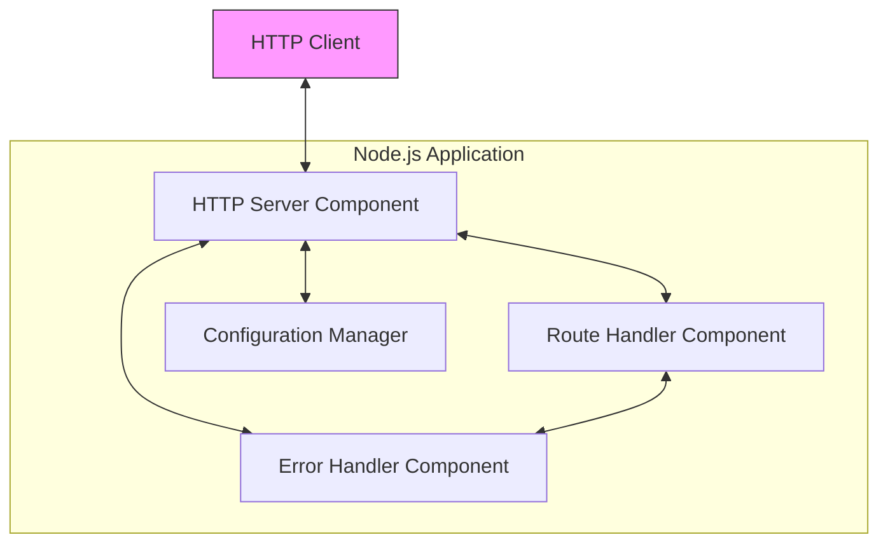
```mermaid
flowchart TD
    Client[HTTP Client] <--> Server
    
    subgraph NodeJS[Node.js Application]
        Server[HTTP Server Component] <--> RouteHandler[Route Handler Component]
        Server <--> ErrorHandler[Error Handler Component]
        Server <--> Config[Configuration Manager]
        RouteHandler <--> ErrorHandler
    end
    
    classDef external fill:#f9f,stroke:#333,stroke-width:1px
    class Client external
```

#### Request Processing Sequence Diagram

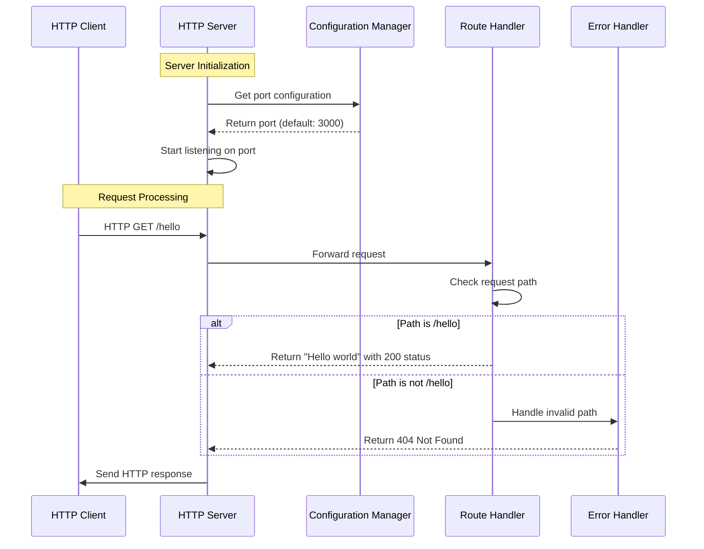
```mermaid
sequenceDiagram
    participant Client as HTTP Client
    participant Server as HTTP Server
    participant Config as Configuration Manager
    participant Router as Route Handler
    participant Error as Error Handler
    
    Note over Server: Server Initialization
    Server->>Config: Get port configuration
    Config-->>Server: Return port (default: 3000)
    Server->>Server: Start listening on port
    
    Note over Client,Server: Request Processing
    Client->>Server: HTTP GET /hello
    Server->>Router: Forward request
    Router->>Router: Check request path
    
    alt Path is /hello
        Router-->>Server: Return "Hello world" with 200 status
    else Path is not /hello
        Router->>Error: Handle invalid path
        Error-->>Server: Return 404 Not Found
    end
    
    Server->>Client: Send HTTP response
```

#### Server State Transition Diagram

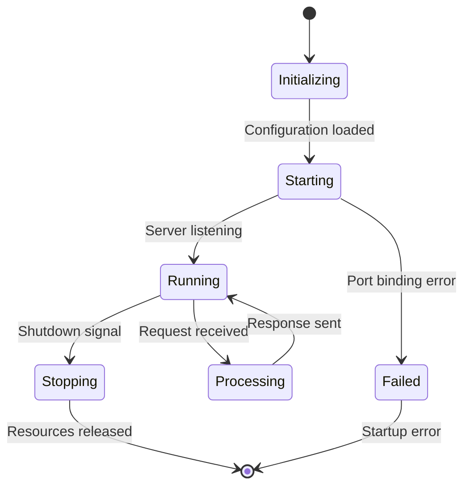
```mermaid
stateDiagram-v2
    [*] --> Initializing
    Initializing --> Starting: Configuration loaded
    Starting --> Running: Server listening
    Starting --> Failed: Port binding error
    
    Running --> Processing: Request received
    Processing --> Running: Response sent
    
    Running --> Stopping: Shutdown signal
    Stopping --> [*]: Resources released
    Failed --> [*]: Startup error
```

### TECHNICAL DECISIONS

#### Architecture Style Decisions

| Decision | Selected Approach | Alternatives Considered | Rationale |
|----------|-------------------|-------------------------|-----------|
| Server Architecture | Monolithic | Microservices, Serverless | Simplicity and educational value for a minimal example |
| Dependency Strategy | Zero external dependencies | Express.js, Fastify, Koa | Demonstrate core Node.js capabilities without abstraction layers |
| Error Handling | Centralized handler | Try-catch blocks, Middleware | Consistent error responses with minimal complexity |

#### Communication Pattern Choices

| Pattern | Implementation | Rationale |
|---------|----------------|-----------|
| Request-Response | Synchronous HTTP | Standard web service pattern, simplest to implement and understand |
| Content Type | Plain text | Minimal complexity for demonstration purposes |
| Status Codes | Standard HTTP codes (200, 404) | Adherence to HTTP standards |

#### Architecture Decision Record: Minimal Dependencies

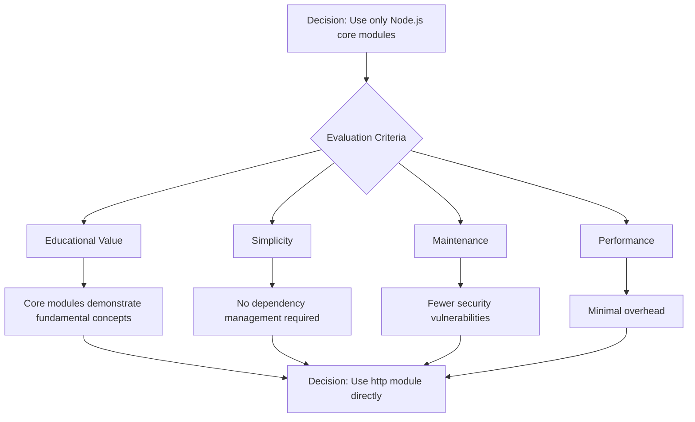
```mermaid
flowchart TD
    A[Decision: Use only Node.js core modules] --> B{Evaluation Criteria}
    B --> C[Educational Value]
    B --> D[Simplicity]
    B --> E[Maintenance]
    B --> F[Performance]
    
    C --> G[Core modules demonstrate fundamental concepts]
    D --> H[No dependency management required]
    E --> I[Fewer security vulnerabilities]
    F --> J[Minimal overhead]
    
    G --> K[Decision: Use http module directly]
    H --> K
    I --> K
    J --> K
```

### CROSS-CUTTING CONCERNS

#### Monitoring and Observability Approach

For this minimal application, monitoring is limited to basic console logging of server events:

- Server startup with port information
- Request logging (optional, for development)
- Error logging for failed requests or server issues

More sophisticated monitoring would be unnecessary for this educational example.

#### Logging Strategy

| Log Type | Implementation | Purpose |
|----------|----------------|---------|
| Startup Logs | Console output | Confirm server initialization and port binding |
| Error Logs | Console error output | Document error conditions for troubleshooting |
| Request Logs (optional) | Console output | Development-time visibility into requests |

#### Error Handling Patterns

The application implements a simple but effective error handling strategy:

- Server startup errors: Log detailed error and exit process
- Route not found errors: Return 404 status with appropriate message
- Unexpected runtime errors: Catch, log, and return 500 status

#### Error Handling Flow

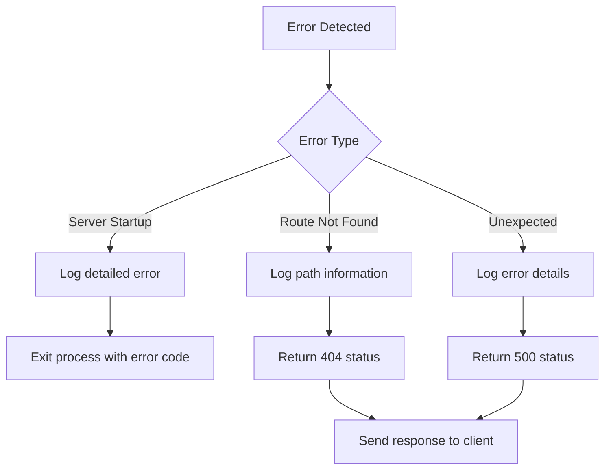
```mermaid
flowchart TD
    A[Error Detected] --> B{Error Type}
    
    B -->|Server Startup| C[Log detailed error]
    C --> D[Exit process with error code]
    
    B -->|Route Not Found| E[Log path information]
    E --> F[Return 404 status]
    
    B -->|Unexpected| G[Log error details]
    G --> H[Return 500 status]
    
    F --> I[Send response to client]
    H --> I
```

#### Performance Requirements

| Metric | Requirement | Implementation Approach |
|--------|-------------|-------------------------|
| Response Time | < 50ms | Minimal processing logic |
| Memory Usage | < 50MB | No unnecessary dependencies |
| Startup Time | < 1 second | Direct use of core modules |

The simple nature of this application inherently supports these performance requirements without additional optimization. The direct use of Node.js core modules with minimal processing logic ensures fast response times and low resource utilization.

## 6. SYSTEM COMPONENTS DESIGN

### SERVER COMPONENT

#### Component Overview

The Server Component serves as the core infrastructure element of the application, responsible for creating and managing the HTTP server instance that listens for incoming client requests.

| Aspect | Description |
|--------|-------------|
| Primary Responsibility | Create and manage HTTP server lifecycle |
| Key Functions | Initialize server, bind to port, route requests, handle errors |
| Dependencies | Node.js HTTP module |
| Interfaces | HTTP listener interface |

#### Component Structure

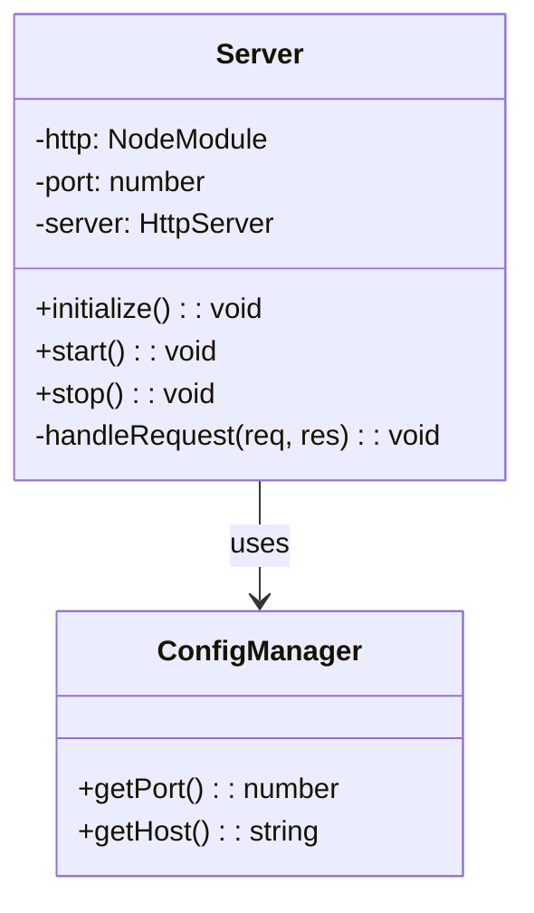
```mermaid
classDiagram
    class Server {
        -http: NodeModule
        -port: number
        -server: HttpServer
        +initialize(): void
        +start(): void
        +stop(): void
        -handleRequest(req, res): void
    }
    
    class ConfigManager {
        +getPort(): number
        +getHost(): string
    }
    
    Server --> ConfigManager: uses
```

#### Functional Description

The Server Component performs these key functions:

1. **Initialization**: Creates an HTTP server instance using Node.js core HTTP module
2. **Configuration**: Applies server settings (port, host) from configuration
3. **Request Routing**: Directs incoming requests to appropriate handlers
4. **Error Management**: Handles server-level errors (port conflicts, etc.)
5. **Lifecycle Management**: Provides methods to start and stop the server

#### Interface Specifications

| Interface | Description | Input Parameters | Return Value |
|-----------|-------------|------------------|-------------|
| initialize() | Creates server instance | None | void |
| start() | Binds to port and begins listening | None | void |
| stop() | Gracefully shuts down server | None | Promise\<void\> |
| handleRequest() (private) | Processes incoming HTTP requests | req: IncomingMessage, res: ServerResponse | void |

#### Error Handling

| Error Scenario | Handling Approach |
|----------------|-------------------|
| Port already in use | Log detailed error, exit process with non-zero code |
| Invalid configuration | Log error, use default values where possible |
| Unhandled exceptions | Log error, prevent server crash, return 500 response |

### ROUTE HANDLER COMPONENT

#### Component Overview

The Route Handler Component is responsible for processing HTTP requests, matching URL paths, and generating appropriate responses.

| Aspect | Description |
|--------|-------------|
| Primary Responsibility | Match request paths and generate responses |
| Key Functions | Path matching, response generation |
| Dependencies | Server Component |
| Interfaces | Request handler function |

#### Component Structure

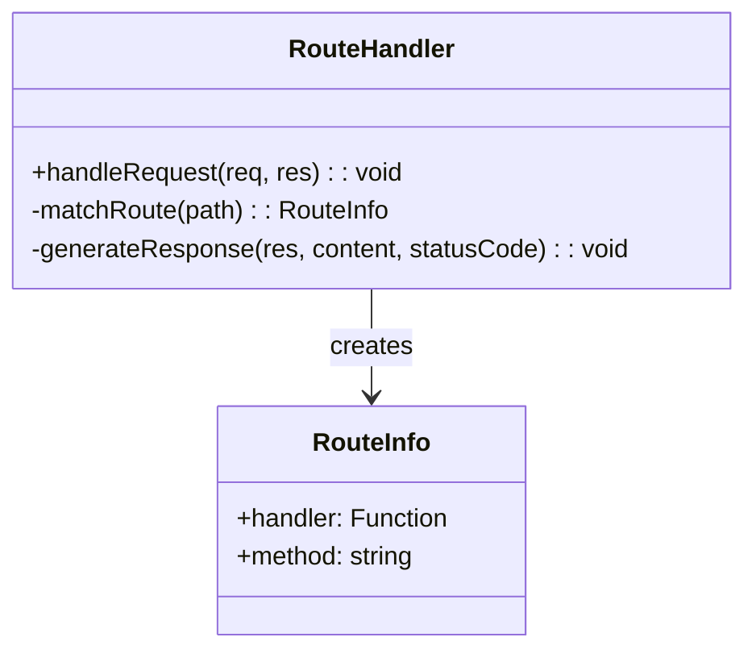
```mermaid
classDiagram
    class RouteHandler {
        +handleRequest(req, res): void
        -matchRoute(path): RouteInfo
        -generateResponse(res, content, statusCode): void
    }
    
    class RouteInfo {
        +handler: Function
        +method: string
    }
    
    RouteHandler --> RouteInfo: creates
```

#### Functional Description

The Route Handler Component performs these key functions:

1. **Path Matching**: Determines if the request URL matches defined routes
2. **Method Validation**: Verifies HTTP method is supported for the route
3. **Response Generation**: Creates appropriate HTTP responses with correct status codes
4. **Content Formatting**: Sets appropriate content type headers

#### Interface Specifications

| Interface | Description | Input Parameters | Return Value |
|-----------|-------------|------------------|-------------|
| handleRequest() | Main request processing function | req: IncomingMessage, res: ServerResponse | void |
| matchRoute() (private) | Matches URL path to defined routes | path: string | RouteInfo or null |
| generateResponse() (private) | Creates and sends HTTP response | res: ServerResponse, content: string, statusCode: number | void |

#### Route Definitions

| Route | HTTP Method | Response | Status Code | Content Type |
|-------|------------|----------|-------------|--------------|
| /hello | GET | "Hello world" | 200 | text/plain |
| * (all others) | * | "Not Found" | 404 | text/plain |

#### Error Handling

| Error Scenario | Handling Approach |
|----------------|-------------------|
| Route not found | Return 404 status with "Not Found" message |
| Method not allowed | Return 405 status with "Method Not Allowed" message |
| Processing error | Return 500 status with generic error message |

### CONFIGURATION COMPONENT

#### Component Overview

The Configuration Component manages application settings, providing default values and environment variable overrides.

| Aspect | Description |
|--------|-------------|
| Primary Responsibility | Manage server configuration |
| Key Functions | Retrieve configuration values, apply defaults |
| Dependencies | Node.js process environment |
| Interfaces | Configuration getter methods |

#### Component Structure

```mermaid
classDiagram
    class ConfigManager {
        -defaults: Object
        +getPort(): number
        +getHost(): string
        -getEnvValue(key, defaultValue): any
    }
```

#### Functional Description

The Configuration Component performs these key functions:

1. **Default Values**: Provides sensible defaults for all configuration options
2. **Environment Variables**: Reads configuration from environment variables
3. **Value Validation**: Ensures configuration values are valid
4. **Configuration Access**: Provides getter methods for configuration values

#### Interface Specifications

| Interface | Description | Input Parameters | Return Value |
|-----------|-------------|------------------|-------------|
| getPort() | Returns configured server port | None | number |
| getHost() | Returns configured server host | None | string |
| getEnvValue() (private) | Retrieves value from environment with fallback | key: string, defaultValue: any | any |

#### Configuration Parameters

| Parameter | Environment Variable | Default Value | Description |
|-----------|----------------------|---------------|-------------|
| Port | PORT | 3000 | TCP port for HTTP server |
| Host | HOST | "0.0.0.0" | Network interface to bind to |

#### Error Handling

| Error Scenario | Handling Approach |
|----------------|-------------------|
| Invalid port number | Log warning, use default port |
| Invalid host value | Log warning, use default host |

### ERROR HANDLER COMPONENT

#### Component Overview

The Error Handler Component provides centralized error management for the application.

| Aspect | Description |
|--------|-------------|
| Primary Responsibility | Process and respond to errors |
| Key Functions | Error logging, error response generation |
| Dependencies | Server Component, Route Handler Component |
| Interfaces | Error handling functions |

#### Component Structure

```mermaid
classDiagram
    class ErrorHandler {
        +handleServerError(error): void
        +handleRouteError(req, res, error): void
        +handleNotFound(req, res): void
        -logError(error, context): void
    }
```

#### Functional Description

The Error Handler Component performs these key functions:

1. **Error Logging**: Records error details for troubleshooting
2. **Response Generation**: Creates appropriate error responses
3. **Error Classification**: Categorizes errors for appropriate handling
4. **Process Protection**: Prevents application crashes from unhandled errors

#### Interface Specifications

| Interface | Description | Input Parameters | Return Value |
|-----------|-------------|------------------|-------------|
| handleServerError() | Processes server-level errors | error: Error | void |
| handleRouteError() | Handles errors during request processing | req: IncomingMessage, res: ServerResponse, error: Error | void |
| handleNotFound() | Generates 404 responses | req: IncomingMessage, res: ServerResponse | void |
| logError() (private) | Logs error details | error: Error, context: string | void |

#### Error Response Formats

| Error Type | Status Code | Response Format | Headers |
|------------|-------------|-----------------|---------|
| Not Found | 404 | Plain text: "Not Found" | Content-Type: text/plain |
| Method Not Allowed | 405 | Plain text: "Method Not Allowed" | Content-Type: text/plain |
| Server Error | 500 | Plain text: "Internal Server Error" | Content-Type: text/plain |

#### Error Handling Flow

```mermaid
flowchart TD
    A[Error Detected] --> B{Error Type}
    B -->|Not Found| C[handleNotFound]
    B -->|Route Error| D[handleRouteError]
    B -->|Server Error| E[handleServerError]
    
    C --> F[Log Error]
    D --> F
    E --> F
    
    F --> G{Can Send Response?}
    G -->|Yes| H[Generate Error Response]
    G -->|No| I[Log Fatal Error]
    
    H --> J[Send Response to Client]
    I --> K[Exit Process if Necessary]
```

### COMPONENT INTERACTIONS

#### Request Processing Sequence

```mermaid
sequenceDiagram
    participant Client
    participant Server
    participant RouteHandler
    participant ErrorHandler
    
    Client->>Server: HTTP GET /hello
    Server->>RouteHandler: handleRequest(req, res)
    
    alt Path is /hello
        RouteHandler->>RouteHandler: matchRoute("/hello")
        RouteHandler->>RouteHandler: generateResponse(res, "Hello world", 200)
        RouteHandler-->>Client: 200 OK "Hello world"
    else Path not found
        RouteHandler->>ErrorHandler: handleNotFound(req, res)
        ErrorHandler->>ErrorHandler: logError(error, "Route not found")
        ErrorHandler->>ErrorHandler: generateResponse(res, "Not Found", 404)
        ErrorHandler-->>Client: 404 Not Found
    else Processing error
        RouteHandler->>ErrorHandler: handleRouteError(req, res, error)
        ErrorHandler->>ErrorHandler: logError(error, "Route processing")
        ErrorHandler->>ErrorHandler: generateResponse(res, "Internal Server Error", 500)
        ErrorHandler-->>Client: 500 Internal Server Error
    end
```

#### Component Dependency Diagram

```mermaid
flowchart TD
    Client[HTTP Client] <--> Server
    
    subgraph Application
        Server[Server Component] --> RouteHandler[Route Handler Component]
        Server --> ConfigManager[Configuration Component]
        Server --> ErrorHandler[Error Handler Component]
        RouteHandler --> ErrorHandler
    end
    
    classDef external fill:#f9f,stroke:#333,stroke-width:1px
    class Client external
```

#### Data Flow Diagram

```mermaid
flowchart LR
    Client([HTTP Client]) -->|HTTP Request| Server
    
    subgraph Application
        Server -->|Request Object| RouteHandler
        RouteHandler -->|Response Data| Server
        RouteHandler -->|Error| ErrorHandler
        ErrorHandler -->|Error Response| Server
        ConfigManager -->|Configuration| Server
    end
    
    Server -->|HTTP Response| Client
```

### COMPONENT DESIGN CONSIDERATIONS

#### Performance Optimization

| Component | Optimization Technique | Expected Benefit |
|-----------|------------------------|------------------|
| Server | Non-blocking I/O | Efficient handling of concurrent requests |
| Route Handler | Direct path matching | Minimal overhead for request routing |
| Configuration | One-time initialization | Avoid repeated environment variable lookups |
| Error Handler | Centralized error processing | Consistent error handling with minimal duplication |

#### Security Considerations

| Component | Security Consideration | Implementation Approach |
|-----------|------------------------|-------------------------|
| Server | Port binding restrictions | Use non-privileged ports (>1024) |
| Route Handler | Input validation | Validate request paths before processing |
| Configuration | Sensitive data protection | No sensitive data in this simple application |
| Error Handler | Information disclosure | Generic error messages to clients |

#### Testability Design

| Component | Testability Feature | Testing Approach |
|-----------|---------------------|------------------|
| Server | Dependency injection | Mock HTTP module for unit testing |
| Route Handler | Pure functions | Unit test with mock request/response objects |
| Configuration | Environment isolation | Override environment variables during testing |
| Error Handler | Error simulation | Trigger various error conditions for coverage |

#### Extensibility Points

| Component | Extension Point | Extension Method |
|-----------|----------------|------------------|
| Server | Request preprocessing | Add middleware support |
| Route Handler | Additional routes | Extend route matching logic |
| Configuration | Additional parameters | Add new configuration getters |
| Error Handler | Custom error types | Add specialized error handlers |

### 6.1 CORE SERVICES ARCHITECTURE

Core Services Architecture is not applicable for this system in its traditional sense. This Node.js Hello World application is intentionally designed as a monolithic, single-service application that exposes one HTTP endpoint. The simplicity of the requirements does not warrant a microservices architecture, service discovery mechanisms, or complex resilience patterns.

#### Simplified Architecture Justification

| Aspect | Justification |
|--------|---------------|
| Single Service | The application's functionality (returning "Hello world") is minimal and self-contained |
| No Service Boundaries | No logical separation of concerns that would benefit from service isolation |
| No Inter-service Communication | No need for service-to-service communication patterns |

Instead of a distributed architecture, this application employs a straightforward request-response pattern using Node.js's built-in HTTP module:

```mermaid
flowchart LR
    Client[HTTP Client] <-->|HTTP Request/Response| Server[Node.js HTTP Server]
    Server -->|Process Request| Handler[Route Handler]
    Handler -->|Generate Response| Server
```

#### Simplified Scaling Approach

While traditional microservice scaling patterns are not applicable, the application can still be scaled if needed:

| Scaling Method | Implementation Approach |
|----------------|-------------------------|
| Horizontal Scaling | Deploy multiple instances behind a load balancer |
| Vertical Scaling | Increase resources (CPU/memory) for the Node.js process |
| Process Clustering | Use Node.js cluster module to utilize multiple CPU cores |

```mermaid
flowchart TD
    Client[HTTP Clients] <--> LB[Load Balancer]
    
    subgraph "Horizontal Scaling (if needed)"
        LB --> S1[Server Instance 1]
        LB --> S2[Server Instance 2]
        LB --> S3[Server Instance 3]
    end
    
    subgraph "Process Clustering (if needed)"
        Master[Master Process] --> W1[Worker 1]
        Master --> W2[Worker 2]
        Master --> W3[Worker 3]
    end
```

#### Simplified Resilience Approach

For this minimal application, resilience is addressed through basic error handling rather than complex patterns:

| Resilience Aspect | Implementation Approach |
|-------------------|-------------------------|
| Error Handling | Try/catch blocks for request processing |
| Process Monitoring | Use process managers like PM2 for auto-restart |
| Logging | Basic console logging for troubleshooting |

```mermaid
stateDiagram-v2
    [*] --> Running
    Running --> Error: Exception occurs
    Error --> Restarting: Process manager detects
    Restarting --> Running: Service restored
    Running --> [*]: Graceful shutdown
```

#### Implementation Considerations

While the application doesn't require complex service architecture, certain best practices can still be applied:

| Practice | Implementation |
|----------|----------------|
| Configuration | Environment variables for port settings |
| Health Checks | Optional `/health` endpoint for monitoring |
| Graceful Shutdown | Handle SIGTERM signals properly |

This simplified approach aligns with the educational purpose of the application, demonstrating core Node.js HTTP server concepts without introducing unnecessary complexity.

### 6.2 DATABASE DESIGN

Database Design is not applicable to this system. The Node.js Hello World application with a single `/hello` endpoint that returns "Hello world" does not require any persistent data storage for the following reasons:

1. **Stateless Operation**: The application functions as a stateless service that processes HTTP requests and returns static responses without needing to store or retrieve data.

2. **No Dynamic Content**: The response "Hello world" is static and does not depend on any stored data or user-specific information.

3. **No User Management**: The application does not implement authentication, user profiles, or session management that would require persistent storage.

4. **No Transaction Processing**: There are no business transactions or operations that need to be recorded or tracked over time.

5. **No Configuration Storage**: All configuration (such as port number) is handled through environment variables or defaults in the application code.

#### Alternative Approaches

If future extensions of this application required data persistence, several options could be considered:

| Approach | Use Case | Implementation Complexity |
|----------|----------|---------------------------|
| File-based storage | Simple logging, basic metrics | Low |
| In-memory data structures | Request caching, rate limiting | Low |
| NoSQL database | Unstructured data storage, scaling | Medium |
| Relational database | Structured data with relationships | Medium-High |

#### Data Flow Without Persistence

The current application's data flow is straightforward without database interactions:

```mermaid
flowchart LR
    Client[HTTP Client] -->|HTTP Request| Server[Node.js Server]
    Server -->|Process Request| Handler[Route Handler]
    Handler -->|Generate Static Response| Server
    Server -->|HTTP Response "Hello world"| Client
    
    classDef noStorage fill:#f9f9f9,stroke:#333,stroke-width:1px,stroke-dasharray: 5 5
    class Handler noStorage
```

This diagram illustrates that all processing occurs in memory without any persistent storage components.

#### Future Considerations

If the application were to evolve to require data persistence, the following considerations would become relevant:

1. **Performance Impact**: Adding database interactions would increase response latency
2. **Deployment Complexity**: Database dependencies would add complexity to deployment and operations
3. **Scaling Considerations**: Data storage would introduce new scaling challenges
4. **Security Requirements**: Persistent data would require additional security controls

For the current requirements, maintaining the application as a stateless service without database dependencies is the most appropriate design choice, keeping it simple, lightweight, and easy to deploy.

### 6.3 INTEGRATION ARCHITECTURE

Integration Architecture is not applicable for this system in its traditional sense. The Node.js Hello World application is intentionally designed as a standalone service with minimal complexity that exposes a single HTTP endpoint without requiring integration with external systems or services.

The reasons for this simplified approach include:

1. **Educational Purpose**: The application serves as a learning tool demonstrating basic Node.js HTTP server functionality without the complexity of external integrations.

2. **Self-Contained Functionality**: The sole purpose of returning "Hello world" to HTTP clients requires no external data sources, authentication services, or third-party APIs.

3. **Minimal Dependencies**: The implementation uses only Node.js core modules without external libraries or frameworks that would necessitate integration patterns.

4. **Stateless Operation**: The application maintains no state between requests and requires no persistent storage or external state management.

#### Simplified API Design

While full integration architecture is not applicable, the application does implement a minimal REST API with the following characteristics:

| Aspect | Implementation |
|--------|----------------|
| Protocol | HTTP/1.1 |
| Endpoint | GET /hello |
| Response Format | Plain text |
| Status Codes | 200 (Success), 404 (Not Found) |

```mermaid
sequenceDiagram
    participant Client as HTTP Client
    participant Server as Node.js Server
    
    Client->>Server: HTTP GET /hello
    Server->>Server: Process request
    Server-->>Client: 200 OK "Hello world"
    
    Client->>Server: HTTP GET /unknown
    Server->>Server: Process request
    Server-->>Client: 404 Not Found
```

#### Future Integration Considerations

If the application were to evolve beyond its current scope, the following integration patterns could be considered:

```mermaid
flowchart TD
    Client[HTTP Client] <--> Server[Node.js Server]
    
    subgraph "Potential Future Integrations"
        Server -.-> Auth[Authentication Service]
        Server -.-> Metrics[Metrics Collection]
        Server -.-> Logging[Centralized Logging]
    end
    
    classDef future fill:#f9f9f9,stroke:#333,stroke-width:1px,stroke-dasharray: 5 5
    class Auth,Metrics,Logging future
```

| Integration Type | Implementation Approach | When to Consider |
|------------------|-------------------------|------------------|
| Authentication | JWT or API Key validation | If access control becomes necessary |
| Monitoring | Metrics reporting to external service | For production deployment monitoring |
| Logging | Structured logging to central system | For distributed deployment troubleshooting |

For the current requirements, maintaining the application as a standalone service without external integrations is the most appropriate design choice, keeping it simple, lightweight, and easy to understand for educational purposes.

### 6.4 SECURITY ARCHITECTURE

Detailed Security Architecture is not applicable for this system. The Node.js Hello World application is intentionally designed as a minimal demonstration with a single public endpoint that returns static content without authentication, authorization requirements, or sensitive data handling.

Instead of implementing complex security controls, this application will follow these standard security practices:

#### Standard Security Practices

| Practice Area | Implementation Approach |
|---------------|-------------------------|
| Input Validation | Basic URL path validation to prevent path traversal attacks |
| Error Handling | Generic error messages that don't expose system details |
| HTTP Headers | Appropriate security headers for basic protection |
| Dependency Management | Using only Node.js core modules to minimize vulnerability surface |

#### Security Considerations

While comprehensive security architecture is not required, the following basic security considerations will be addressed:

```mermaid
flowchart TD
    A[Security Considerations] --> B[Input Validation]
    A --> C[Error Handling]
    A --> D[HTTP Headers]
    A --> E[Server Configuration]
    
    B --> B1[Validate request paths]
    B --> B2[Prevent path traversal]
    
    C --> C1[Generic error messages]
    C --> C2[Proper error logging]
    
    D --> D1[Content-Type headers]
    D --> D2[Basic security headers]
    
    E --> E1[Non-privileged ports]
    E --> E2[Minimal permissions]
```

#### HTTP Security Headers

| Header | Value | Purpose |
|--------|-------|---------|
| X-Content-Type-Options | nosniff | Prevent MIME type sniffing |
| X-Frame-Options | DENY | Prevent clickjacking attacks |
| Content-Security-Policy | default-src 'none' | Restrict resource loading |

#### Security Zones

```mermaid
flowchart LR
    Client([HTTP Client]) <-->|HTTP Request/Response| PublicZone
    
    subgraph PublicZone[Public Zone]
        Server[Node.js HTTP Server]
        Handler[Route Handler]
    end
    
    Server --> Handler
    
    classDef public fill:#d4f4d4,stroke:#333
    class PublicZone public
```

This diagram illustrates the simple security zone architecture, where the entire application operates in a single public zone with no protected resources or authentication boundaries.

#### Security Implementation Recommendations

| Area | Recommendation |
|------|----------------|
| Deployment | Run with non-root user |
| Network | Use non-privileged ports (>1024) |
| Process | Implement proper signal handling |
| Logging | Avoid logging sensitive information |

#### Security Exclusions

The following security controls are explicitly excluded as they are not applicable to this minimal application:

1. **Authentication Framework**: No user identity management is required
2. **Authorization System**: No protected resources requiring access control
3. **Data Protection**: No sensitive data processing or storage
4. **Compliance Controls**: No regulatory requirements for this educational example

If the application were to be extended beyond its current educational purpose or deployed in a production environment, a comprehensive security assessment would be recommended to identify additional controls needed based on the expanded scope and risk profile.

### 6.5 MONITORING AND OBSERVABILITY

Detailed Monitoring Architecture is not applicable for this system. The Node.js Hello World application is intentionally designed as a minimal demonstration with a single endpoint that returns static content. Implementing comprehensive monitoring infrastructure would introduce unnecessary complexity for this educational example.

Instead, the application will follow these basic monitoring practices:

#### Basic Monitoring Practices

| Practice | Implementation | Purpose |
|----------|----------------|---------|
| Console Logging | Server startup and error logs | Provide visibility into application state |
| Basic Health Check | Optional `/health` endpoint | Enable simple availability monitoring |
| Process Monitoring | Use of process managers (PM2, nodemon) | Ensure application restarts after crashes |

#### Health Check Implementation

A simple health check endpoint can be added to provide basic monitoring capability:

```mermaid
flowchart TD
    Client[Monitoring Client] -->|GET /health| Server[Node.js Server]
    Server -->|Process Request| Handler[Health Check Handler]
    Handler -->|Generate Status| Server
    Server -->|"200 OK status:up"| Client
```

#### Basic Metrics Collection

For this minimal application, metrics collection will be limited to:

| Metric | Collection Method | Importance |
|--------|-------------------|------------|
| Server Uptime | Process uptime tracking | Basic availability indicator |
| Request Count | In-memory counter (optional) | Basic usage tracking |
| Response Time | Simple timing calculation (optional) | Basic performance indicator |

#### Simple Logging Strategy

The application will implement a straightforward logging approach:

```mermaid
flowchart LR
    Event[Application Event] -->|Generate| Log[Console Log]
    Log -->|Capture| Terminal[Terminal/Console]
    Log -.->|Optional| File[Log File]
```

| Log Level | Usage | Example |
|-----------|-------|---------|
| INFO | Server startup, requests | "Server started on port 3000" |
| ERROR | Request failures, exceptions | "Error processing request: ..." |
| DEBUG | Detailed operation (dev only) | "Request received: GET /hello" |

#### Process Monitoring

For improved reliability, basic process monitoring can be implemented:

```mermaid
flowchart TD
    PM[Process Manager] -->|Start| App[Node.js Application]
    App -->|Crash| PM
    PM -->|Restart| App
    PM -->|Metrics| Console[Console Output]
```

#### Alert Considerations

For production deployments, consider these minimal alert conditions:

| Condition | Severity | Response |
|-----------|----------|----------|
| Process not running | High | Automatic restart |
| Health check failure | Medium | Manual investigation |
| High error rate | Low | Review logs |

#### Monitoring Evolution Path

If the application were to evolve beyond its educational purpose, consider this monitoring evolution path:

```mermaid
flowchart LR
    Basic[Basic Console Logging] --> Structured[Structured Logging]
    Structured --> Centralized[Centralized Log Collection]
    Basic --> Metrics[Basic Metrics]
    Metrics --> APM[Application Performance Monitoring]
    
    classDef current fill:#d4f4d4,stroke:#333
    classDef future fill:#f9f9f9,stroke:#333,stroke-width:1px,stroke-dasharray: 5 5
    
    class Basic current
    class Structured,Centralized,Metrics,APM future
```

#### Implementation Recommendations

For this minimal application, the following implementation is recommended:

1. **Server Startup Logging**: Log port and host information when server starts
2. **Error Logging**: Capture and log any exceptions or errors
3. **Optional Request Logging**: For development, log basic request information
4. **Process Manager**: Use nodemon for development and PM2 for production if needed

This approach provides sufficient visibility for educational purposes while maintaining the simplicity that makes the application valuable as a learning tool.

### 6.6 TESTING STRATEGY

#### TESTING APPROACH

##### Unit Testing

For this Node.js Hello World application, unit testing will focus on verifying the core functionality of individual components in isolation.

| Framework/Tool | Purpose | Configuration |
|----------------|---------|---------------|
| Jest | Primary testing framework | Default configuration with Node environment |
| Supertest | HTTP assertions | Used for testing HTTP responses |

**Test Organization Structure**

```
/tests
  /unit
    server.test.js    # Tests for server initialization
    routes.test.js    # Tests for route handling
    config.test.js    # Tests for configuration management
```

**Mocking Strategy**

| Component | Mocking Approach | Tools |
|-----------|------------------|-------|
| HTTP Module | Mock request/response objects | Jest mock functions |
| Configuration | Environment variable overrides | Jest mock modules |

**Code Coverage Requirements**

| Component | Coverage Target | Critical Paths |
|-----------|-----------------|---------------|
| Route Handler | 100% | Path matching, response generation |
| Server | 90% | Initialization, error handling |
| Configuration | 90% | Environment variable processing |

**Test Naming Conventions**

```
describe('Component: Feature', () => {
  test('should behave in a certain way when something happens', () => {
    // Test implementation
  });
});
```

**Test Data Management**

For this simple application, test data will be minimal and defined inline within test files. No external test data management is required.

##### Integration Testing

| Test Type | Approach | Tools |
|-----------|----------|-------|
| API Testing | HTTP requests to running server | Supertest |
| Component Integration | Test interactions between components | Jest |

**API Testing Strategy**

```mermaid
flowchart TD
    A[Start Server] --> B[Send HTTP Request to /hello]
    B --> C{Verify Response}
    C -->|Success| D[Verify 200 Status]
    C -->|Failure| E[Verify Error Handling]
    D --> F[Verify Response Body]
    E --> G[Verify Error Status Code]
    F --> H[Stop Server]
    G --> H
```

**Test Environment Management**

For this simple application, tests will run in a local environment with a dynamically assigned test port to avoid conflicts.

##### End-to-End Testing

For this minimal application with a single endpoint, comprehensive end-to-end testing is not required. However, basic E2E verification will be implemented:

| Test Scenario | Verification Points | Tools |
|---------------|---------------------|-------|
| Server Startup | Server starts and listens on port | Shell script |
| Hello Endpoint | Returns correct response | curl/wget |

**Performance Testing Requirements**

Basic performance benchmarks will be established to ensure the application meets minimal performance criteria:

| Metric | Target | Testing Tool |
|--------|--------|-------------|
| Response Time | < 50ms (avg) | Apache Bench |
| Requests/Second | > 1000 | Apache Bench |
| Memory Usage | < 50MB | Node.js process monitoring |

#### TEST AUTOMATION

**CI/CD Integration**

```mermaid
flowchart TD
    A[Code Push] --> B[Run Linting]
    B --> C[Run Unit Tests]
    C --> D[Run Integration Tests]
    D --> E[Run Performance Tests]
    E --> F{All Tests Pass?}
    F -->|Yes| G[Deploy]
    F -->|No| H[Fail Build]
```

**Automated Test Triggers**

| Trigger | Test Types | Environment |
|---------|------------|-------------|
| Pull Request | Unit, Integration | CI environment |
| Merge to Main | Unit, Integration, Performance | CI environment |

**Test Reporting Requirements**

| Report Type | Format | Distribution |
|-------------|--------|--------------|
| Test Results | JUnit XML | CI dashboard |
| Coverage Report | HTML, lcov | CI dashboard |

**Failed Test Handling**

| Failure Type | Action | Notification |
|--------------|--------|-------------|
| Unit Test | Fail build | PR comments |
| Integration Test | Fail build | PR comments |
| Performance Test | Warning | Team notification |

#### QUALITY METRICS

**Code Coverage Targets**

| Component | Line Coverage | Branch Coverage | Function Coverage |
|-----------|--------------|-----------------|-------------------|
| Overall | ≥ 90% | ≥ 85% | 100% |
| Critical Components | 100% | 100% | 100% |

**Quality Gates**

| Gate | Requirement | Enforcement |
|------|------------|-------------|
| Linting | No errors | Block PR |
| Unit Tests | 100% pass | Block PR |
| Code Coverage | Meet targets | Block PR |
| Integration Tests | 100% pass | Block PR |

**Documentation Requirements**

| Documentation | Content | Location |
|---------------|---------|----------|
| Test README | Setup instructions | /tests/README.md |
| Test Examples | Sample test patterns | /tests/examples |

#### TEST EXECUTION FLOW

```mermaid
flowchart TD
    A[Developer Machine] -->|Run Tests Locally| B[Local Test Execution]
    C[Code Repository] -->|Trigger CI Pipeline| D[CI Environment]
    D --> E[Setup Test Environment]
    E --> F[Run Linting]
    F --> G[Run Unit Tests]
    G --> H[Run Integration Tests]
    H --> I[Generate Reports]
    I --> J[Publish Results]
    
    subgraph "Local Testing"
        B --> B1[Unit Tests]
        B --> B2[Integration Tests]
    end
    
    subgraph "CI Testing"
        F
        G
        H
        I
        J
    end
```

#### TEST ENVIRONMENT ARCHITECTURE

```mermaid
flowchart LR
    A[Test Runner] --> B[Node.js Process]
    B --> C[HTTP Server]
    D[Test Client] --> C
    
    subgraph "Test Environment"
        B
        C
        E[Mock Objects]
    end
    
    A --> E
    E --> B
```

#### EXAMPLE TEST PATTERNS

**Unit Test Example (routes.test.js)**

```javascript
describe('Route Handler: /hello endpoint', () => {
  test('should return 200 status code for GET /hello', () => {
    // Test implementation
  });
  
  test('should return "Hello world" text for GET /hello', () => {
    // Test implementation
  });
  
  test('should return 404 for undefined routes', () => {
    // Test implementation
  });
});
```

**Integration Test Example (api.test.js)**

```javascript
describe('API Integration: /hello endpoint', () => {
  let server;
  
  beforeAll(() => {
    // Start server
  });
  
  afterAll(() => {
    // Stop server
  });
  
  test('should respond to GET /hello with Hello world', async () => {
    // Test implementation using supertest
  });
});
```

#### SECURITY TESTING CONSIDERATIONS

| Test Type | Focus Area | Tools |
|-----------|------------|-------|
| Dependency Scanning | Vulnerability detection | npm audit |
| Static Analysis | Code quality and security | ESLint security plugins |

For this simple application with no authentication, database, or complex security requirements, extensive security testing is not applicable. Basic security best practices will be verified through code review and static analysis.

#### RESOURCE REQUIREMENTS

| Resource | Specification | Purpose |
|----------|--------------|---------|
| CI Environment | Node.js runtime | Test execution |
| Memory | 1GB minimum | Test execution |
| Storage | 1GB minimum | Test artifacts |

The testing strategy for this Node.js Hello World application is intentionally lightweight and focused on verifying the core functionality while maintaining high code quality standards. The approach balances thoroughness with the simplicity of the application to ensure effective testing without unnecessary complexity.

## 7. USER INTERFACE DESIGN

No user interface required. This project is a Node.js HTTP server application that exposes a single REST endpoint `/hello` which returns "Hello world" to HTTP clients. It does not include any graphical user interface components, as it functions purely as a backend web service.

The interaction with this service is intended to be through:
- HTTP clients (browsers, curl, Postman, etc.)
- Programmatic API calls from other applications
- Testing tools

All interaction occurs through the HTTP protocol rather than through a dedicated user interface.

## 8. INFRASTRUCTURE

### OVERVIEW

Detailed Infrastructure Architecture is not applicable for this system. The Node.js Hello World application is intentionally designed as a minimal, standalone HTTP server that exposes a single `/hello` endpoint. The application has the following characteristics that make complex infrastructure unnecessary:

1. **Minimal Resource Requirements**: The application requires only basic Node.js runtime support
2. **Educational Purpose**: The primary goal is to demonstrate fundamental Node.js HTTP server concepts
3. **No External Dependencies**: Uses only Node.js core modules without third-party services
4. **No Persistence Layer**: Does not require databases or other stateful components
5. **Single Service**: Implements a single endpoint without complex service interactions

Instead, this section will focus on the minimal build and distribution requirements needed to run this simple Node.js application in various environments.

### MINIMAL REQUIREMENTS

#### Runtime Environment

| Requirement | Specification | Notes |
|-------------|---------------|-------|
| Node.js | v14.x LTS or higher | LTS versions recommended for stability |
| NPM | v6.x or higher | Included with Node.js installation |
| Operating System | Any OS supporting Node.js | Windows, macOS, Linux all supported |
| Memory | 128MB minimum | Actual usage typically under 50MB |

#### Distribution Package

| Component | Description | Purpose |
|-----------|-------------|---------|
| server.js | Main application file | HTTP server implementation |
| package.json | Project metadata | Dependencies and scripts |
| README.md | Documentation | Setup and usage instructions |
| .gitignore | Git configuration | Excludes node_modules and logs |

### LOCAL DEVELOPMENT SETUP

```mermaid
flowchart TD
    A[Clone Repository] --> B[Install Node.js]
    B --> C[Run npm install]
    C --> D[Start Server: npm start]
    D --> E[Test Endpoint: curl http://localhost:3000/hello]
```

#### Development Tools

| Tool | Purpose | Installation |
|------|---------|-------------|
| Node.js | Runtime environment | Download from nodejs.org |
| Git | Version control | System package manager |
| VS Code | Code editing (optional) | Download from code.visualstudio.com |
| Nodemon | Auto-restart (optional) | npm install -g nodemon |

### BASIC DEPLOYMENT OPTIONS

While complex infrastructure is not required, the application can be deployed in various environments based on needs:

#### Simple Deployment Options

```mermaid
flowchart LR
    subgraph "Development"
        A[Local Machine]
    end
    
    subgraph "Basic Hosting"
        B[VPS/VM]
        C[Node.js Hosting]
    end
    
    subgraph "Serverless"
        D[AWS Lambda]
        E[Azure Functions]
        F[Cloud Run]
    end
    
    subgraph "Container"
        G[Docker Container]
    end
    
    A --> B
    A --> C
    A --> D
    A --> E
    A --> F
    A --> G
```

#### Deployment Comparison

| Deployment Type | Complexity | Cost | Scalability | Use Case |
|-----------------|------------|------|-------------|----------|
| Local Machine | Very Low | Free | None | Development, Learning |
| Basic VM/VPS | Low | $5-10/month | Manual | Simple hosting |
| Node.js Hosting | Low | $0-15/month | Automatic | Easy deployment |
| Serverless | Medium | Pay-per-use | Automatic | Cost optimization |
| Container | Medium | Varies | Manual/Auto | Portability |

### SIMPLE CONTAINERIZATION (OPTIONAL)

While not required, containerization can provide consistency across environments. A minimal Dockerfile would look like:

```mermaid
flowchart TD
    A[FROM node:14-alpine] --> B[WORKDIR /app]
    B --> C[COPY package*.json ./]
    C --> D[RUN npm install --production]
    D --> E[COPY . .]
    E --> F[EXPOSE 3000]
    F --> G["CMD ['node', 'server.js']"]
```

#### Container Build and Run

| Command | Purpose | Notes |
|---------|---------|-------|
| docker build -t hello-node . | Build container image | Run from project directory |
| docker run -p 3000:3000 hello-node | Run container | Maps container port to host |
| docker-compose up | Alternative with compose | Requires docker-compose.yml |

### SIMPLE CI/CD (OPTIONAL)

For teams wanting basic CI/CD, a minimal GitHub Actions workflow can be implemented:

```mermaid
flowchart TD
    A[Push to Repository] --> B[Run Linting]
    B --> C[Run Tests]
    C --> D{Tests Pass?}
    D -->|Yes| E[Build Package]
    D -->|No| F[Fail Build]
    E --> G[Deploy to Target]
```

#### Sample GitHub Actions Workflow

| Stage | Tools | Purpose |
|-------|-------|---------|
| Lint | ESLint | Code quality verification |
| Test | Jest | Functional verification |
| Build | npm | Package creation |
| Deploy | SSH/SCP or platform SDK | Deployment to target |

### MONITORING BASICS

For basic application monitoring, consider these minimal approaches:

| Monitoring Type | Simple Solution | Purpose |
|-----------------|-----------------|---------|
| Uptime | UptimeRobot (free tier) | Basic availability monitoring |
| Logs | Console output + log files | Troubleshooting |
| Performance | Simple timing logs | Basic performance tracking |
| Process | PM2 process manager | Restart on crash, basic metrics |

### RESOURCE SIZING GUIDELINES

| Resource | Minimum | Recommended | Notes |
|----------|---------|-------------|-------|
| CPU | 0.5 vCPU | 1 vCPU | Single-threaded Node.js process |
| Memory | 128MB | 256MB | Includes Node.js runtime overhead |
| Disk | 100MB | 1GB | Mostly for logs and Node.js installation |
| Network | 10 Mbps | 100 Mbps | Minimal bandwidth requirements |

### MAINTENANCE PROCEDURES

| Procedure | Frequency | Description |
|-----------|-----------|-------------|
| Node.js Updates | Quarterly | Update to latest LTS version |
| Dependency Audit | Monthly | Run npm audit to check for vulnerabilities |
| Log Rotation | Weekly | Prevent log files from growing too large |
| Restart Service | As needed | Refresh application state if needed |

### BACKUP CONSIDERATIONS

| Item | Backup Strategy | Recovery Method |
|------|-----------------|-----------------|
| Source Code | Git repository | Clone repository |
| Configuration | Environment variables | Document and recreate |
| Logs | Archive to separate storage | Restore from archive |

### CONCLUSION

This Node.js Hello World application intentionally maintains minimal infrastructure requirements to serve its educational purpose. The application can be run locally for development and learning, or deployed using various simple hosting options depending on specific needs. The focus remains on the core Node.js HTTP server implementation rather than complex infrastructure concerns.

For production use cases that might evolve from this starting point, additional infrastructure considerations would become relevant, including high availability, scaling, security hardening, and comprehensive monitoring.

## APPENDICES

### ADDITIONAL TECHNICAL INFORMATION

#### Environment Variables

| Variable | Default | Description | Example |
|----------|---------|-------------|---------|
| PORT | 3000 | TCP port on which the HTTP server listens | PORT=8080 node server.js |
| HOST | "0.0.0.0" | Network interface to bind the server to | HOST=127.0.0.1 node server.js |
| NODE_ENV | "development" | Environment mode for the application | NODE_ENV=production node server.js |

#### HTTP Status Codes

| Status Code | Description | Usage in Application |
|-------------|-------------|----------------------|
| 200 | OK | Successful response from `/hello` endpoint |
| 404 | Not Found | Response for undefined routes |
| 500 | Internal Server Error | Response for unhandled exceptions |

#### Node.js Event Loop

```mermaid
flowchart TD
    A[Event Loop Start] --> B[Process Timers]
    B --> C[Process Pending I/O]
    C --> D[Process HTTP Requests]
    D --> E[Process Close Callbacks]
    E --> A
```

#### Signal Handling

| Signal | Description | Application Behavior |
|--------|-------------|----------------------|
| SIGTERM | Termination signal | Graceful shutdown, close HTTP server |
| SIGINT | Interrupt signal (Ctrl+C) | Graceful shutdown, close HTTP server |
| SIGUSR2 | User-defined signal | Used by nodemon for restart (dev only) |

### GLOSSARY

| Term | Definition |
|------|------------|
| Node.js | An open-source, cross-platform JavaScript runtime environment that executes JavaScript code outside a web browser |
| HTTP | Hypertext Transfer Protocol, the foundation of data communication for the World Wide Web |
| REST | Representational State Transfer, an architectural style for designing networked applications |
| Endpoint | A specific URL path that represents a resource or action in a REST API |
| Server | Software or hardware that processes requests and delivers data to clients |
| Client | A program that requests services or resources from a server |
| Port | A virtual point where network connections start and end, identified by a number |
| Request | An HTTP message sent by a client to trigger an action on the server |
| Response | An HTTP message sent by a server to a client in reply to a request |
| Callback | A function passed as an argument to another function, to be executed after an operation completes |

### ACRONYMS

| Acronym | Expansion |
|---------|-----------|
| API | Application Programming Interface |
| CI/CD | Continuous Integration/Continuous Deployment |
| CPU | Central Processing Unit |
| HTTP | Hypertext Transfer Protocol |
| I/O | Input/Output |
| JSON | JavaScript Object Notation |
| LTS | Long-Term Support |
| NPM | Node Package Manager |
| REST | Representational State Transfer |
| SLA | Service Level Agreement |
| TCP | Transmission Control Protocol |
| URL | Uniform Resource Locator |
| VM | Virtual Machine |
| VPS | Virtual Private Server |